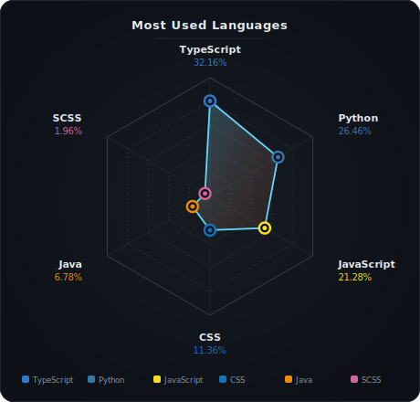

## 🔗 Hi, I'm Junaid Khan

I am a software developer specializing in Java backend systems and Python-based AI applications. I build scalable APIs with Spring Boot and full-stack web applications using the MERN stack. Currently exploring LangChain and RAG to integrate AI into real-world products. I'm always open to collaborating on open-source projects.

- 🔭 Currently building **[LearnVault](https://github.com/junaidify)** – an AI-powered learning platform with paid courses, Razorpay integration, and a **RAG + LangChain** based AI assistant
- 🎬 Currently building **[VideoClipper](https://github.com/junaidify)** – an AI video editing/clipping tool
- 🌱 Currently learning **LangChain** and **RAG (Retrieval-Augmented Generation)** — powering the AI assistant in LearnVault
- 💬 Ask me about **Java, Spring Boot, React, Node.js, MongoDB, Python**
- 📫 Reach me at **[junaidkhan23785@gmail.com](mailto:junaidkhan23785@gmail.com)**

---

## 💻 Programming Languages & Tools

**Languages:**&ensp;   

**Backend:**&ensp;      

**Payments & APIs:**&ensp;  

**Frontend:**&ensp;     

**Databases:**&ensp; 

**Auth:**&ensp;  

**AI / ML:**&ensp; 

**Tools:**&ensp;  

---

## 📊 GitHub Stats

  <!-- Row 1: Stats + Spider Chart side-by-side -->
  
  

  <!-- Row 2: Streak -->
  

  <!-- Row 3: Activity Graph -->
  

---

## 🐍 My Contributions

  <picture>
    <source media="(prefers-color-scheme: dark)" srcset="https://raw.githubusercontent.com/junaidify/junaidify/output/github-contribution-grid-snake-dark.svg" />
    <source media="(prefers-color-scheme: light)" srcset="https://raw.githubusercontent.com/junaidify/junaidify/output/github-contribution-grid-snake.svg" />
    
  </picture>

---

  <i>⚡ "Code is like humor. When you have to explain it, it's bad." — Cory House</i>

